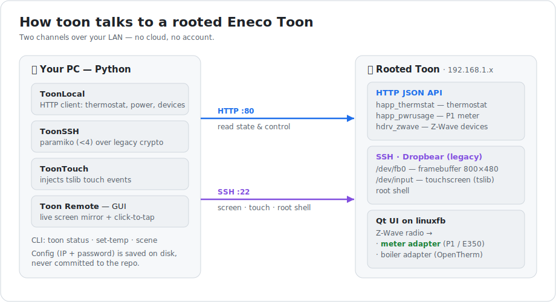
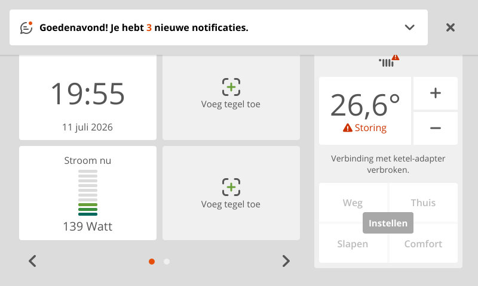

# toon-remote

Local client **and remote control** for a **rooted Eneco Toon** thermostat —
talking straight to the device over your LAN. No cloud, no OAuth, no account.



Read and control the thermostat and P1 smart meter over the Toon's local HTTP
API, and — over SSH — mirror its screen to your PC and drive the touchscreen
remotely.

## Live screen, mirrored to the PC

The Toon renders to a raw framebuffer; with SSH we grab it and can click to tap.
This is a real capture from a Toon (`Stroom nu 139 Watt` = live P1 meter):



## Which Toons does this work on?

- **Rooted Toons only.** The device must be [rooted](https://github.com/ToonSoftwareCollective/Root-A-Toon)
  so it exposes the local HTTP API and SSH. A stock, cloud-only Toon has neither
  (and Eneco's official cloud API is discontinued).
- Applies to the Quby/Eneco **Toon 1 and Toon 2** display (the `qb2` software line).
- The **HTTP JSON API** is present on every rooted Toon firmware.
- The **screen + touch** tooling assumes the standard Toon hardware: an
  **800×480, 32bpp** framebuffer and a **TSC2007** touchscreen read through
  **tslib**. The touch calibration is read live from the device's
  `/etc/pointercal`, so it adapts per unit.
- Developed and tested against firmware **`base-qb2-uni 6.3.80`**, kernel
  `2.6.36` (ARM926). Other rooted firmwares should work.

## Install

```powershell
python -m venv .venv
.venv\Scripts\Activate.ps1
pip install -e ".[gui]"      # Pillow for screenshots/GUI (Tk ships with Python)
```

Or grab a **self-contained binary** (no Python needed) from the
[Releases](../../releases) page — `toon-remote` for Windows and Linux.

## Configure (IP + password)

Connection settings live in a per-user config file — **never in the repo**:

- Windows: `%APPDATA%\toon-remote\config.json`
- Linux/macOS: `~/.config/toon-remote/config.json`

Set them any of these ways:

- **GUI:** launch `toon-remote` and use the **Config…** button (first run asks
  automatically).
- **Env vars:** `TOON_HOST` and `TOON_SSH_PASS`.
- **CLI flag:** `--host`.

The default SSH login on a rooted Toon is `root` / `toon`.

## Remote control (view + touch)

```powershell
python scripts/remote.py                          # or the toon-remote binary
python scripts/tap.py 620 235 --shot after.png    # scripted single tap
python scripts/screenshot.py -o toon.png          # just grab the screen
```

Click anywhere in the window to tap that spot on the Toon. Streaming is ~1 fps
(the Toon's 200 MHz CPU encrypting a 1.5 MB frame is the ceiling), so it's a
tap-and-refresh experience, not video.

Touch works by injecting events into `/dev/input/touchscreen0`, which Qt reads
via tslib. To register, a tap must mimic the real device: `BTN_TOUCH` first,
realistic pressure (~380), ~10 ms samples held a few hundred ms — see
`toon_remote/touch.py`.

## Performance — what to expect

The Toon is a 2015-era box: a **200 MHz ARMv5 (single core), 128 MB RAM**. The
LAN isn't the bottleneck — that little CPU is (every SSH byte is encrypted on
it). Measured on firmware `6.3.80` over a wired LAN:

| Operation | Typical | Notes |
| --- | --- | --- |
| HTTP API call (`toon status`, setpoint, meter) | **20–150 ms** | effectively instant |
| Screen grab (SSH, compressed) | **~1.1 s / frame (≈0.9 fps)** | 1.5 MB frame; compression roughly halves it |
| Screen grab (uncompressed) | ~2.6 s / frame (≈0.4 fps) | — |
| Touch tap | ~0.4 s hold + ~0.5 s round-trip | end-to-end "tap → see result" ≈ **1–2 s** |

So: **the thermostat/meter API is real-time**; the **screen mirror is
tap-and-refresh, not video**. It's great for occasional remote control and
debugging, not for watching animations. `ToonLocal` (HTTP) is what you want for
anything latency-sensitive like automations; reserve SSH streaming for when you
actually need to *see* the screen.

## Use it as a library

```python
from toon_remote import ToonLocal, Scene

toon = ToonLocal()            # host from config, or ToonLocal("192.168.1.50")
info = toon.get_thermostat()
print(info.current_temp, info.setpoint, info.active_scene)

toon.set_setpoint(20.5)       # manual hold
toon.set_scene(Scene.HOME)    # switch preset
toon.resume_program()         # back to the schedule
```

## Command line

```powershell
toon status         # thermostat + live power
toon set-temp 20.5
toon scene home
toon resume
toon devices        # raw Z-Wave device map
```

## SSH access

The Toon runs an ancient Dropbear offering only legacy crypto. From a shell, add
this to `~/.ssh/config`:

```
Host toon 192.168.1.50
  HostName 192.168.1.50
  User root
  HostKeyAlgorithms +ssh-rsa
  KexAlgorithms +diffie-hellman-group14-sha1,diffie-hellman-group1-sha1
  Ciphers +aes128-cbc,3des-cbc
```

Then `ssh toon`. From Python use `toon_remote.ssh.ToonSSH` — note **paramiko must
be `<4`**; v4/v5 dropped the SHA-1 algorithms the Toon needs.

## Local HTTP API reference

| Endpoint | Purpose |
| --- | --- |
| `GET /happ_thermstat?action=getThermostatInfo` | temp, setpoint, scene, burner state |
| `GET /happ_thermstat?action=setSetpoint&Setpoint=2050` | manual hold at 20.50 °C |
| `GET /happ_thermstat?action=changeSchemeState&state=2&temperatureState=N` | scene (Comfort 0 / Home 1 / Sleep 2 / Away 3) |
| `GET /happ_pwrusage?action=GetCurrentUsage` | live electricity / gas usage |
| `GET /hdrv_zwave?action=getDevices.json` | Z-Wave device map (P1 meter, plugs, …) |

Temperatures on the wire are integer centidegrees (`2250` = 22.50 °C). The local
API is **unauthenticated** — keep the Toon on a trusted LAN.

## Roadmap

- [ ] Poll history endpoints for logging.
- [ ] Home Assistant / MQTT bridge.
